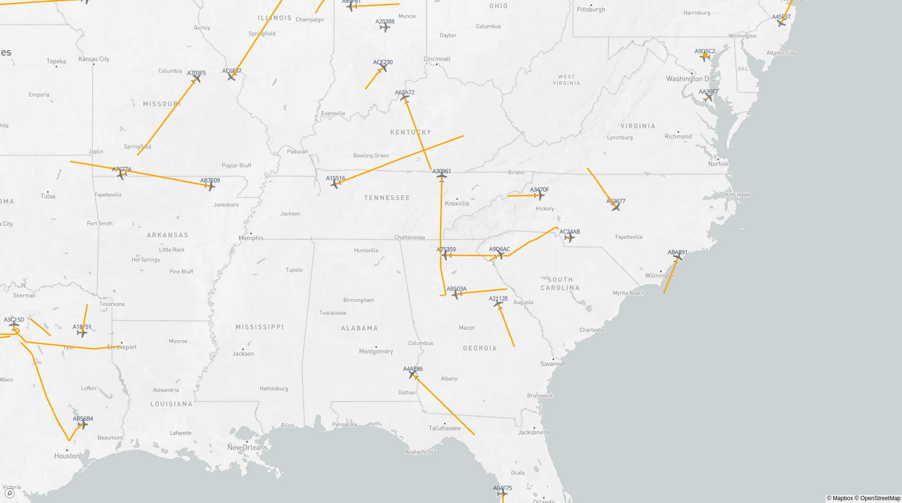

# Opensky Inspector 
Inspector and visualizer for opensky-network.org state vector data archive. this small project is intended to import that data into database cluster then visualize the snap shot data of aircraft flights at any time point.

  

## Get started
 - Run src/main.py
    `python3 main.py`
 - Load your configurations or create one if it doesn't exists:
    `> load ~/opensky-inspector.ini`
 - Download archive data in given datetime range:
    `> download 2020-05-11 2021-05-11`
 - Import (post-process) the data
    `> import`
 - Visualize the imported data
    `> visualize 2020-05-11 11:55:31`
